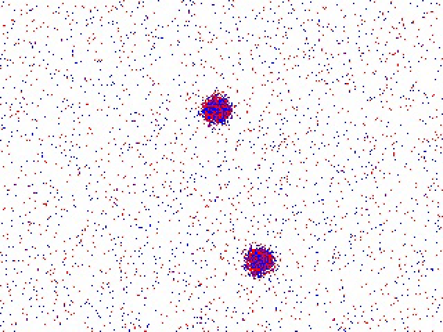
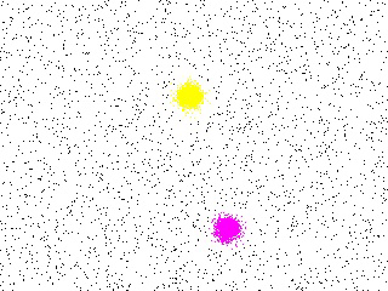

# Event annotation tool

**An interactive asynchronous annotation tool for event-camera data.** You place tracker blobs on the target; a per-event extended Kalman filter (from the [AEB Tracker](https://arxiv.org/abs/2307.10593), IEEE TRO 2024) follows them and labels every event as target (1) or background (0) — with per-object track ids, multi-object workflows, review/retract, and AVI rendering. The asynchronous annotation methodology follows [ASUMOT](https://arxiv.org/abs/2607.11303) ([code](https://github.com/Jia-Bao/ASUMOT)).

[中文文档 (Chinese)](README.zh-CN.md)

| raw events (polarity view) | annotated (id-colored view) |
|:---:|:---:|
|  |  |

## Features

- **Asynchronous annotate / delete** — `A` adds a tracker blob, `D` deletes one (and retracts its labels). The tracker labels events one by one at microsecond resolution.
- **Review, fix, retract** — pause anytime (`P`), add/delete blobs, replay finished data (`--view`); deleting a blob retracts exactly the rows it labeled; `X` removes an entire object id.
- **Multi-object tracking annotation** — one object per pass, covered by as many blobs as needed; all blobs of an object share one id; reload the same raw file for the next object (ids never collide).
- **Disappear / reappear targets** — `R` releases a tracker when the object leaves the frame *keeping* its labels; re-place a blob when it returns, same id.
- **Color scheme** — white canvas, red/blue polarity for raw events, green for non-tracking labels, a 10-color palette per object id; framerate 30/60/120, switchable at runtime.
- **First-frame pre-annotation** — the stream starts frozen so you can place blobs before anything is missed; click START to run from t = 0.
- **AVI export** — MJPG `*_unlabeled_view.avi` (polarity) and `*_labeled_view.avi` (id-colored) rendered from the final labels.
- **Setup window (Windows)** — double-click the exe: pick files (multi-select queue), adjust every parameter, annotate file after file without leaving the app.

## Annotation model

The tracker follows event **blobs**; a real object (e.g. a UAV) is usually covered by **several blobs** — press `A` once per blob.

- `track_mode: false` — single-task annotation: all blobs label events `1`, no ids.
- `track_mode: true` — **one object per run**: every blob you add in the run shares one object id. Press `N` for the next id (or reload); ids are unique and never reused.

Already-labeled events are skipped during association, so in later passes one object's blobs can never steal another object's events — objects may overlap freely on screen.

## Storage: the original csv is never rewritten

```
events.csv           raw events (read-only, checksum-stable)
events_labels.csv    sidecar index: one line "row_index,track_id" per labeled event
events_unlabeled_view.avi / events_labeled_view.avi     rendered views
events_labeled.csv   full merged 6-column csv (on demand, E key)
```

Multi-object annotation loads the **same original file** every pass and accumulates the small sidecar (KB–MB instead of re-writing gigabytes per pass). The sidecar is a plain text file you can inspect or edit. Labels are saved every second while running.

Legacy full-labeled csvs (with a 5th/6th column) are auto-imported into the sidecar on first load.

## Usage

### GUI (recommended)

Launch `eventlabel.exe` with no arguments:

- **Browse...** picks input csv files — multi-select builds a queue; after each file the setup window comes back (the app never exits), START loads the next one. A path can also be pasted directly.
- Editable on the window: width/height, column order, framerate (30/60/120), association gate, pre-annotation window, and checkboxes for track mode / pre-annotate / video export / merged-csv export / view-only.
- Settings persist in `settings.yaml` next to the exe; the kalman noise parameters come from `configs/uav.yaml`.

### Command line (advanced)

```
eventlabel [-c configs/uav.yaml] [--view]
```

### Keys (annotate mode)

| key | action |
|---|---|
| `A` | add a blob (click; several blobs may cover one object) |
| `D` | delete a blob **and retract** its labels (use when the annotation is wrong) |
| `R` | release a blob, **keeping** its labels (use when the object left the frame) |
| `P` / space | pause / resume (A/D/R/N/X work while paused) |
| `S` / enter | start (pre-annotation phase) / resume |
| `N` | next object id (track mode) |
| `X` | remove the most recently annotated object (retracts all its rows) |
| `F` | cycle framerate 30 → 60 → 120 |
| `V` | export both AVI views now |
| `E` | export the full merged csv now |
| `ESC` | end the current file (labels are saved; the setup window returns) |

View mode: `F` / `V` / `E` / `ESC`. Pre-annotation phase: `A`, `N`, START button or `S`.

## Configuration (`configs/uav.yaml`)

| key | meaning | default |
|---|---|---|
| `input_folder_path` / `input_data_name` | input = path + name + `.csv` | – |
| `width` / `height` | canvas = sensor resolution (0-based coordinates) | 1280/720 |
| `data_format` | `0`: ts,c,r,p[,...] · `1`: c,r,p,ts[,...] | 1 |
| `dist_threshold` | minimum association gate (px) | 10 |
| `framerate` | display/export framerate: 30/60/120 | 30 |
| `track_mode` | per-object id annotation | false |
| `pre_annotate` | first-frame pre-annotation + START | true |
| `pre_annotate_time_s` | frozen preview duration (keep small) | 0.05 |
| `export_videos` | auto-export the two AVIs at the end | true |
| `export_csv` | auto-export the merged csv (usually `E` on demand) | false |
| `var_*` / `q_*` | EKF noise parameters (AEB defaults) | see file |

Missing keys fall back to defaults; the legacy `publish_framerate` key is still accepted.

## Data formats

Input (headerless event csv; columns 5/6 optional — if present they are treated as existing labels and imported):

```
data_format=0: ts(us), c, r, p[, label[, track_id]]
data_format=1: c, r, p, ts(us)[, label[, track_id]]
```

Sidecar `*_labels.csv`: `idx,track_id` (`idx` = 0-based data-row ordinal of the input, headers skipped; `-1` for non-tracking labels).

Merged csv (`E`): `c,r,p,ts(us),label,track_id` — one line per input row, integer microseconds.

> Do not modify the original csv between passes — sidecar indices refer to its data rows.

## Multi-object workflow example

```
pass 1: track_mode=true, input events.csv (raw)
        pre-annotate: A over object 1 (several blobs) → START → runs to the end
        → events_labels.csv created (id 0)
pass 2: same input events.csv — the sidecar loads (id 0 shown in its color)
        new blobs automatically annotate object 2 as id 1
pass N: repeat; press X to redo the latest object, D/R to fix single blobs,
        --view (or the view-only checkbox) to check the result
final:  press E once to export the full csv for training
```

Object leaves the frame? `P` → `R` on its blob (labels kept) → resume; when it reappears `P` → `A` at the new position (same id).

## Migrating from the pre-open-source tool

- Coordinates are no longer shifted by +1 on load (the shift broke reload workflows). Set `width/height` to the real sensor resolution (e.g. 1281×992 → 1280×992).
- Old outputs (`*_label_opint.csv`, 5/6-column full csvs) load directly; their label columns are imported into the sidecar automatically on first load.
- Old timestamp columns beyond 1 s lost precision (6 significant digits); index-based sidecars are immune.

## Acknowledgments & citation

The asynchronous annotation methodology follows ASUMOT:

> Baofeng Jia, Xiaoyu Chen, Jingyuan Zhang, Zongze Wu, Haochen Li, Jing Han, Lianfa Bai,
> "ASUMOT: Motion-Consistency-Based Asynchronous UAV Detection and Tracking with Event Cameras",
> arXiv:2607.11303, 2026. [paper](https://arxiv.org/abs/2607.11303) · [code](https://github.com/Jia-Bao/ASUMOT)

The tracking core is derived from the AEB Tracker:

> Ziwei Wang, Timothy Molloy, Pieter van Goor and Robert Mahony, "Asynchronous Blob Tracker for Event Cameras", *IEEE Transactions on Robotics*, 2024. [arXiv:2307.10593](https://arxiv.org/abs/2307.10593)

If you use this tool, please cite the ASUMOT paper (annotation methodology), the AEB paper (tracking core), and link this release.

## License

Academic use only — see [LICENSE](LICENSE). The upstream AEB Tracker is released "for academic use only", and the derived tracking core inherits that restriction.
